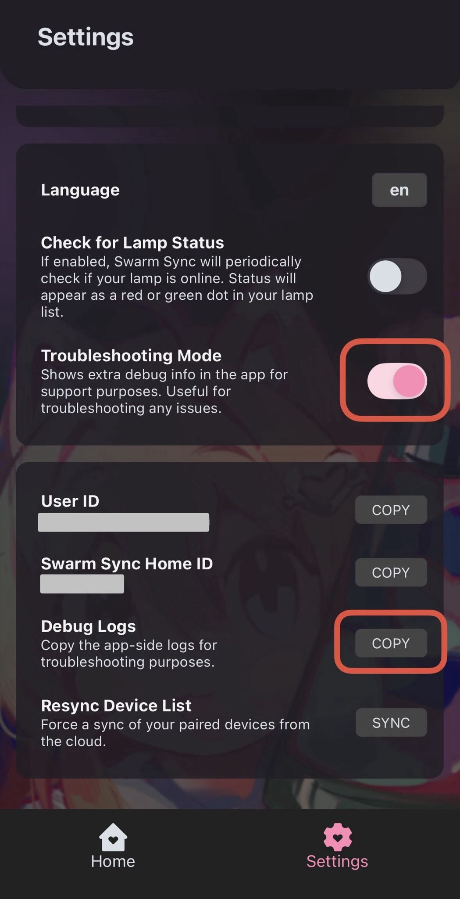
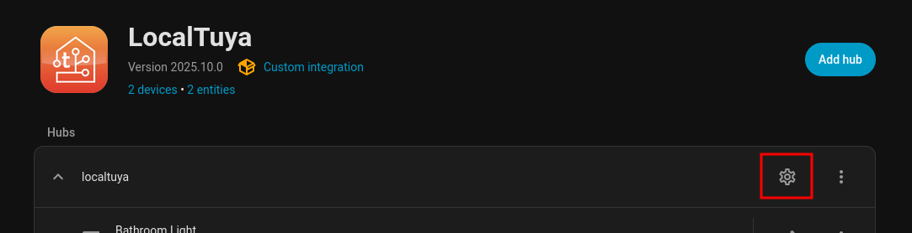
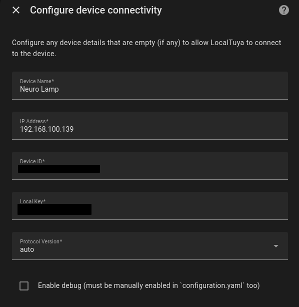

# Neuro-sama Lava Lamp for Home Assistant

Here's a guide on how to add the Neuro-sama Lava Lamp to Home Assistant.

## Prerequisites

- [Home Assistant](https://home-assistant.io)
- [LocalTuya integration](https://github.com/xZetsubou/hass-localtuya/)

## Setup

1. Add the lamp in the Swarm Sync app if you haven't already.
2. Turn on troubleshooting mode in Settings, then copy the debug logs and paste them in your preferred text editor.

3. Get your local key by searching your logs for `localKey` and copying the 16-character string next to it without the quotes. For example, if your log looked like this:
```
,"localKey":"a1bc2de345fg6789",
```
Your local key would be `a1bc2de345fg6789`.
4. Get the device ID by searching the logs again for `devId` and following the same instructions above, or, in the Swarm Sync app, open the device controls and look under the name of your lamp, that's also your device ID.
5. If you haven't used LocalTuya before, follow the instructions [here](https://xzetsubou.github.io/hass-localtuya/usage/installation/). Make sure to disable the cloud API. For picking the data center, refer to [this chart](https://github.com/tuya/tuya-home-assistant/blob/main/docs/regions_dataCenters.md).
6. Now, download the entity template. Right click [this link](https://github.com/IceBotYT/ha-neuro-lamp/raw/refs/heads/main/assets/Neuro_Lamp.yaml), click "Save link as..." and put it into your config under `/config/custom_components/localtuya/templates`. Then, restart Home Assistant.
7. Open the configuration like so:

8. Click Add new device.
9. Use your local key and device ID from earlier to fill out the form like so (leave all optional fields blank):


If this doesn't work, try setting Protocol Version to 3.5!

10. Once connected successfully, click "Use saved template" and choose your new `yaml` file you imported in step 8.
11. Keep clicking Submit until you see the success screen.

Congratulations! Your lava lamp is now ready to be used.

## Stream Sync?

Stream Sync can't be turned on inside Home Assistant. (at least, not yet) You can, however, open the Swarm Sync app and turn on the toggle to sync to stream there.

## Problems pairing?

Try the troubleshooting available [here](https://swarmsync.app/support.html). Otherwise, join [the Discord](https://discord.gg/neurosama) and check the pinned messages in [this forum post](https://discord.com/channels/574720535888396288/1426970657631113376) for the most up to date information.
